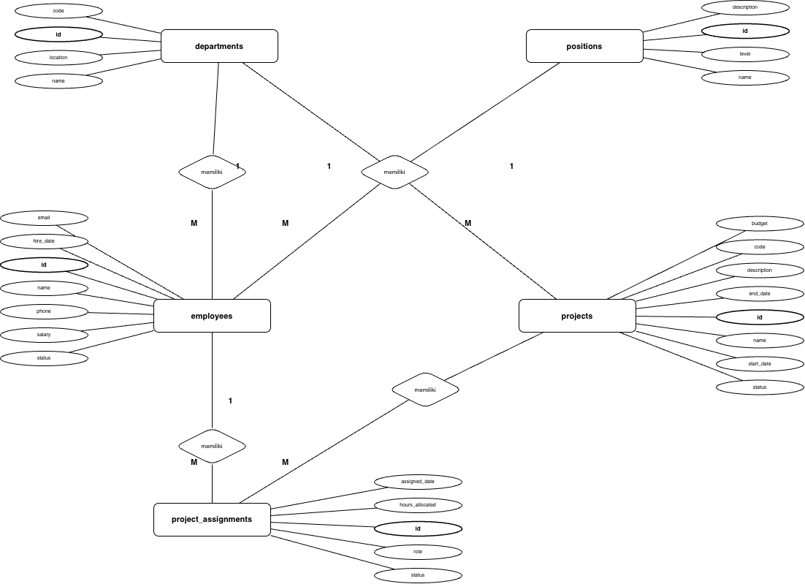

# 📊 ERD Generator - Chen Notation

Aplikasi Python untuk **membuat Entity-Relationship Diagram (ERD)** dalam format **draw.io** dari file SQL database Anda secara **otomatis & cepat**.

Menggunakan **Chen's ER Model** dengan:
- 🏢 Entity (Rectangle)
- 📝 Attribute (Ellipse)
- 💎 Relationship (Diamond) dengan label "memiliki"
- 🔗 Cardinality (1/M)

---
# ℹ️ NOTE
---

> **⚠️ CATATAN PENTING:**  
> Diagram yang dihasilkan **tidak sepenuhnya rapi** dan memerlukan **penyesuaian manual** di draw.io.  
> Script ini menghasilkan struktur dasar ERD - Anda perlu **mengedit posisi, spacing, dan layout** untuk hasil yang lebih optimal.  
> Gunakan fitur drag-and-drop di draw.io untuk merapikan diagram sesuai kebutuhan.

---

## ✨ Fitur Utama

✅ **Parse SQL Otomatis** - Baca file SQL dan ekstrak struktur database  
✅ **Generate ERD Chen** - Buat diagram dengan model Chen yang rapi  
✅ **Support Semua Relasi** - Handle 1:N dan M:N relationships  
✅ **Cardinality Labels** - Tampilkan M & 1 secara otomatis  
✅ **Dynamic Layout** - Spacing otomatis berdasarkan jumlah attribute  
✅ **Draw.io Format** - Output langsung buka di draw.io  
✅ **Interactive Mode** - Input file, output name, dan diagram name secara interaktif  
✅ **Customizable Config** - Edit warna, layout, dan skip columns via `database.py`  
✅ **Zero Dependencies** - Hanya butuh `lxml` (lightweight)  
✅ **Separation of Concerns** - Config terpisah dari logic (obfuscation-ready)

---
## 🎨 Output Preview

### Diagram yang Dihasilkan



*Contoh ERD yang dihasilkan oleh script dengan Chen Notation*
Ketika dibuka di draw.io:
- ✅ Semua entity terlihat rapi
- ✅ Relationship diamond dengan label "memiliki"
- ✅ Cardinality (M & 1) di garis relasi
- ✅ Attribute teorganisir per entity
- ✅ Layout hierarki otomatis
- ✅ Bisa di-edit & customize langsung di draw.io


## 🚀 Quick Start

### 1. Clone Repository
```bash
git clone https://github.com/andypratama3/erd-generator-chen-notation.git
cd erd-generator-chen-notation/dist
```

### 2. Install Dependencies
```bash
pip install -r requirements.txt
```

### 3. Siapkan File (PENTING!)
```bash
# 1. Pastikan ada file database.py (sudah include di repo)
ls database.py  # ✅ Harus ada!

# 2. Letakkan file SQL Anda di folder dist/
cp ~/my-database.sql .
```

### 4. Jalankan Script
```bash
python3 generate-erd.py
```

Script akan meminta input:

**Step 1: Pilih File SQL**
```
📂 File SQL yang tersedia:
   1. database-example.sql (default)
   2. database-ansor.sql

🔍 Pilih file SQL:
   Tekan Enter untuk default: database-example.sql
Masukkan nomor (1-2) atau Enter: 1
✅ File dipilih: database-example.sql
```

**Step 2: Tentukan Nama Output**
```
💾 Nama output file (default: erd-chen-notation.drawio):
Masukkan nama (atau tekan Enter): my-erd
✅ Output: my-erd.drawio
```

**Step 3: Tentukan Nama Diagram**
```
📊 Nama diagram (default: ERD Chen FINAL):
Masukkan nama (atau tekan Enter): My Database
✅ Diagram: My Database
```

**Output:**
```
======================================================================
✅ ERD CHEN BERHASIL DIBUAT!
======================================================================
📊 Total Tabel         : 5
🔗 Total Relasi        : 6
📈 Jumlah Layer        : 2
💾 File Output         : my-erd.drawio
======================================================================
```

### 5. Buka di Draw.io
1. Buka https://app.diagrams.net
2. File → Open → Pilih file `.drawio`
3. Diagram langsung muncul!

---

## 📋 Project Structure

```
erd-generator-chen-notation/
│
├── README.md
│
└── dist/
    ├── database.py              (⚙️ EDIT CONFIG DI SINI)
    ├── generate-erd.py          (🔒 JANGAN EDIT - Read-only)
    ├── database-example.sql     (📄 Contoh SQL)
    └── database-ansor.sql       (📄 Contoh SQL kompleks)
```

**PENTING:**
- ✅ **Edit `database.py`** untuk customization (warna, layout, skip columns)
- ❌ **JANGAN edit `generate-erd.py`** - script obfuscate

---

## 🔧 Customization via `database.py`

**SEMUA KUSTOMISASI dilakukan di file `database.py`**. File `generate-erd.py` adalah **read-only** dan tidak boleh diubah.

### 1. **Ganti Default File**
```python
# Edit database.py
SQL_FILE = "my-database.sql"  # Default SQL file
OUTPUT_FILE = "MY_ERD.drawio"  # Default output name
DIAGRAM_NAME = "My Database ERD"  # Default diagram title
```

### 2. **Ubah Warna**
```python
# Edit warna border, fill, dan line
COLORS = {
    "border": "#FF0000",   # Merah
    "fill": "#FFFF00",     # Kuning
    "line": "#0000FF",     # Biru
}
```

### 3. **Ubah Layout & Spacing**
```python
LAYOUT = {
    "padding_x": 200,       # Jarak horizontal lebih jauh
    "padding_y": 200,       # Jarak vertical lebih jauh
    "col_width": 600,       # Jarak antar kolom tabel
    "entity_width": 180,    # Lebar entity box
    "entity_height": 50,    # Tinggi entity box
    "attr_spacing": 40,     # Jarak antar attribute
    "attr_per_side": 15,    # Max attribute per sisi
}
```

### 4. **Skip Kolom Tertentu**
```python
SKIP_COLUMNS = {
    'created_at',
    'updated_at',
    'deleted_at',
    'remember_token',
    'email_verified_at',
    'your_custom_column',   # Tambah kolom yang ingin di-skip
}
```

### 5. **Custom Styling Detail**
```python
# Entity styling
ENTITY_STYLE = {
    "strokeWidth": "2",      # Border lebih tebal
    "fontSize": "12",        # Font lebih besar
    "fontStyle": "1",        # Bold
}

# Attribute styling
ATTRIBUTE_STYLE = {
    "strokeWidth": "1",
    "fontSize": "8",         # Font attribute
}

# Relationship diamond styling
RELATIONSHIP_STYLE = {
    "strokeWidth": "1.5",
    "fontSize": "9",
}
```

---

## 🎯 Workflow Sehari-hari

### Use Case 1: Database Baru
```bash
# 1. Export database
mysqldump -u root -p my_database > my_database.sql

# 2. Copy ke folder dist/
cp my_database.sql dist/

# 3. Edit database.py (opsional - set default)
nano dist/database.py
# Ubah: SQL_FILE = "my_database.sql"

# 4. Generate ERD
cd dist
python3 generate-erd.py
# Atau langsung tekan Enter 3x jika sudah set default

# 5. Buka file .drawio di draw.io
```

### Use Case 2: Ubah Style
```bash
# 1. Edit database.py
nano dist/database.py

# 2. Ubah warna/layout sesuai kebutuhan
COLORS = {"border": "#FF0000", ...}

# 3. Generate ulang
python3 generate-erd.py

# 4. Buka file baru di draw.io
```

### Use Case 3: Skip Kolom Custom
```bash
# 1. Edit database.py
nano dist/database.py

# 2. Tambah kolom di SKIP_COLUMNS
SKIP_COLUMNS = {
    'created_at',
    'updated_at',
    'my_custom_field',  # Tambah di sini
}

# 3. Generate ulang
python3 generate-erd.py
```

---

## 📊 Cara Kerja Script

### 1. **Arsitektur Separation**
```
database.py (Config)  →  generate-erd.py (Logic)  →  Output .drawio
     ↑                           ↓
  User Edit              Read-only (obfuscate file)
```

### 2. **Parsing SQL**
Script membaca file SQL dan mengekstrak:
- Nama tabel
- Kolom (attributes)
- Primary keys
- Foreign keys

### 3. **Deteksi Relasi**
- **1:N Relations**: Deteksi via FOREIGN KEY
- **M:N Relations**: Deteksi junction tables (tables dengan ≥2 foreign keys)

### 4. **Skip Columns Otomatis**
Script otomatis skip kolom yang didefinisikan di `SKIP_COLUMNS` dalam `database.py`:
- `created_at`, `updated_at`, `deleted_at` (default)
- Bisa ditambah custom columns

### 5. **Layout Algorithm**
- Menggunakan topological sorting untuk layering
- Dynamic spacing berdasarkan jumlah attributes
- Attributes dibagi kiri-kanan (max configurable per sisi)

### 6. **Generate Draw.io XML**
- Create entities (rectangles)
- Create attributes (ellipses) dengan garis ke entity
- Create relationship diamonds dengan label "memiliki"
- Add cardinality labels (M dan 1)

---

## 📊 Contoh Output

### Relasi 1:N
```
DEPARTMENTS (1) ──── ◇ memiliki ◇ ──── (M) EMPLOYEES
```

### Relasi M:N
```
EMPLOYEES (M) ──── ◇ memiliki ◇ ──── (M) PROJECTS
       (via junction table: PROJECT_ASSIGNMENTS)
```

### Attributes
- Primary key: **Bold ellipse** dengan border lebih tebal
- Regular attributes: Normal ellipse
- Foreign keys: Tidak ditampilkan sebagai attribute (sudah jadi relasi)

---

## 🐛 Troubleshooting

### Error: "database.py tidak ditemukan!"
```bash
# Pastikan file database.py ada
ls database.py

# Jika tidak ada, copy dari template atau repo
cp database.py.example database.py
```

### Error: "Tidak ada file SQL di folder ini!"
```bash
# Pastikan file SQL ada di folder yang sama dengan script
ls *.sql

# Atau pindah ke folder dist/
cd dist
python3 generate-erd.py
```

### Error: "ModuleNotFoundError: lxml"
```bash
pip install -r requirements.txt
```

### Error: SQL parsing gagal
Script hanya support MySQL format:
```sql
✅ Benar:
CREATE TABLE `users` (
  `id` int AUTO_INCREMENT PRIMARY KEY,
  FOREIGN KEY (`role_id`) REFERENCES `roles`(`id`)
);

❌ Salah (PostgreSQL):
CREATE TABLE users (
  id SERIAL PRIMARY KEY
);
```

### Diagram terlalu padat/renggang
```python
# Edit database.py
LAYOUT = {
    "col_width": 700,    # Perbesar jarak antar kolom
    "padding_x": 200,    # Perbesar padding
    "padding_y": 200,
}
```

### Ingin ubah warna seragam
```python
# Edit database.py
COLORS = {
    "border": "#2C3E50",  # Dark blue
    "fill": "#ECF0F1",    # Light gray
    "line": "#2C3E50",    # Dark blue
}
```

### Config tidak berpengaruh
```bash
# Pastikan database.py di folder yang sama dengan generate-erd.py
ls -la
# Harus ada: database.py dan generate-erd.py

# Cek apakah ada syntax error di database.py
python3 -m py_compile database.py
```

---

## 📚 Technical Details

### Supported SQL Features
- ✅ CREATE TABLE statements
- ✅ PRIMARY KEY constraints
- ✅ FOREIGN KEY constraints
- ✅ ENGINE specification
- ❌ VIEWs, TRIGGERs, PROCEDUREs (ignored)

### Layout Logic
1. **Topological Sort**: Mengurutkan tabel berdasarkan dependencies
2. **Layering**: Tabel dikelompokkan per level berdasarkan foreign keys
3. **Dynamic Height**: Tinggi layer disesuaikan dengan jumlah max attributes
4. **Attribute Split**: Attributes dibagi kiri-kanan untuk menghindari overlap

### Junction Table Detection
Junction table otomatis terdeteksi jika:
- Memiliki ≥2 foreign keys (configurable via `JUNCTION_TABLE_RULES`)
- Hanya punya max 1 kolom non-foreign key (selain timestamps)

### Configuration Priority
1. **Interactive input** - User input saat runtime (SQL file, output name, diagram name)
2. **database.py** - Default values & styling config
3. **Hardcoded fallback** - Jika database.py tidak ada (error)

---

## ⚙️ Advanced Configuration

### Dynamic Height Calculation
```python
DYNAMIC_HEIGHT = {
    "base": 45,
    "attribute_spacing": 32,
    "bottom_padding": 150,
    "top_padding": 20,
}
```

### Cardinality Label Positioning
```python
CARDINALITY_LABEL = {
    "offset_x": -8,
    "offset_y": -8,
    "width": 16,
    "height": 16,
    "fontSize": "11",
    "fontStyle": "1",
}
```

### Junction Table Detection Rules
```python
JUNCTION_TABLE_RULES = {
    "min_foreign_keys": 2,
    "max_non_fk_columns": 1,
}
```

---

## 📄 License

MIT License - Bebas digunakan & modify

---

## 🆘 Support

Jika ada issue:
1. ✅ Pastikan file SQL dalam format MySQL
2. ✅ Library `lxml` sudah terinstall
3. ✅ File `database.py` ada di folder yang sama dengan `generate-erd.py`
4. ✅ Edit **HANYA** `database.py` untuk customization
5. ✅ **JANGAN** edit `generate-erd.py` (Jangan Merubah File ini)

---

## 🎓 Best Practices

### ✅ DO:
- Edit `database.py` untuk semua customization
- Gunakan interactive mode untuk testing cepat
- Set default values di `database.py` untuk workflow berulang
- Commit `database.py` ke Git untuk team consistency
- Test config changes dengan file SQL kecil dulu

### ❌ DON'T:
- Jangan edit `generate-erd.py` (obfuscate-file)
- Jangan hardcode config di `generate-erd.py`
- Jangan skip primary keys di `SKIP_COLUMNS`
- Jangan hapus `database.py` (mandatory file)

---
